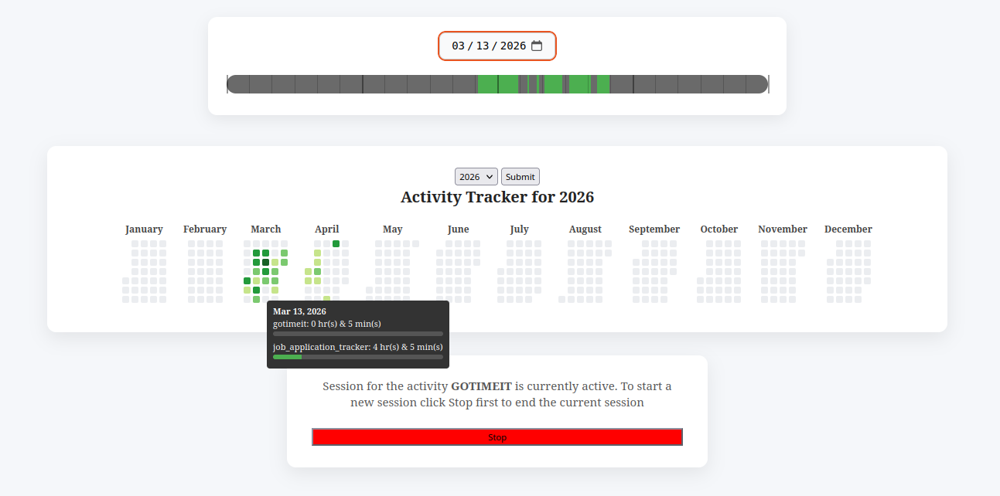

# Gotimeit

A CLI tool that tracks how much time I spend on programming and displays it in a GitHub-like activity chart, created mainly to **quatify/improve** the time I spend on programming.

### Commands

* ```start```: Start tracking time for an activity. 
```bash
gotimeit start --activity writing
```

* ```end```: End the current session.
```bash
gotimeit end
```

* ```today```: See how much time you've spent today, per activity.
```bash
gotimeit today
```

* ```summary```:  Starts a local web server.
```bash
gotimeit summary
```



## Credits

gotimeit uses the following libraries
* [urfave/cli](https://github.com/urfave/cli/v3) - CLI framework
* [chi](https://github.com/go-chi/chi/) - HTTP router
* [ApexCharts](https://github.com/apexcharts) - Frontend charts
* [SimpleTable](https://github.com/alexeyco/simpletable) - Terminal tables
